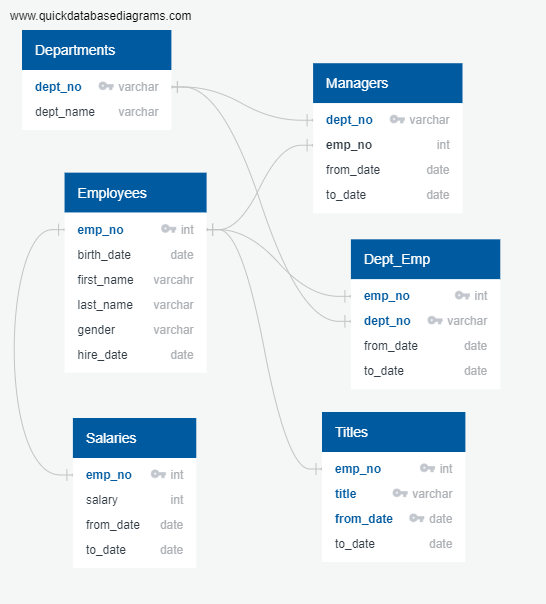

# Pewlett-Hackard-Analysis

As Pewlett Hackard is looking towards the future, we need to take into account current employees reaching retirement age. As people begin to retire, positions that will need to be filled in the near future should be considered. This will lead to thousands of potential job openings. If these potential vacancies are not considered, this could lead to large gaps in the company. I have performed queries in SQL to help determine who is retiring, how many people will be retiring, and which positions the retiring employees currently hold.  

The available data about Pewlett Hackard and the employees was available within the following six CSV files: departments, dept_emp, dept_manager, employees, salaries, and titles. The original CSV files are located in the data folder. Using the six csv files combined with data modeling, engineering, and analysis skills, an employee database has been built in SQL. Before querying the data, an entity-relationship-diagram (ERD) was built to highlight the different tables and their relationships to each other. The ERD can be referenced below and from the EmployeeDB.PNG file.

Each of the connecting lines indicate the relationships between each of the tables and their primary keys (unique identifiers for their dataset). The schema.txt file illustrates the relationship between the tables further and was used as a building block for generating the tables in SQL. Each of the tables from the 
