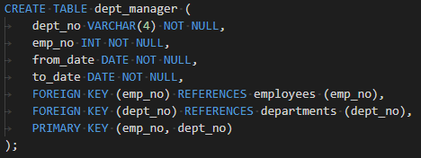

# Pewlett-Hackard-Analysis

As Pewlett Hackard is looking towards the future, we need to take into account current employees reaching retirement age. As people begin to retire, these positions will become vacant and consequently need to be filled. I have performed queries in SQL to help determine who is retiring, how many people will be retiring, and which positions the retiring employees currently hold.

The available data about Pewlett Hackard and their employees was provided through the following six CSV files: departments, dept_emp, dept_manager, employees, salaries, and titles. The original CSV files are located in the data folder. Using the six csv files combined with data modeling, engineering, and analysis skills, an employee database has been built in SQL. Before querying the data, an entity-relationship-diagram (ERD) was built to highlight the different tables and their relationships to each other. The ERD can be referenced below and from the EmployeeDB.PNG file.

Each of the connecting lines indicate the relationships between each of the tables, including their primary keys (unique identifiers for their dataset) and foreign keys (references to another table's primary key). In addition, the schema.txt file illustrates the relationship between the tables further and was used as a building block for generating the tables in SQL. 

A reference of the code created for each table is demonstrated below:

As can be seen from the dept_manager table, each of the data columns from the dept_manager CSV file was specified as well as the foreign keys and primary key. The foreign and primary keys are used to maintain data integrity because they define the relationship the table has with the other tables. 

Once all the data was imported into the six tables, I began to make queries and ask the database questions regarding retirement eligibility. All of the queries asked to the database can be found in the Queries.sql file with their outputs in the Queries folder. An outline of the queries asked can be found below:

- retirement_info: all employees born between 1952 and 1955, and hired between 1985 and 1988
- current_emp: narrows down all employees from the retirement_info to only currently employed employees
- emp_count: number of employees potentially retiring from the current_emp query
- emp_info: lists all of the employees from current_emp including their gender and salary
- manager_info: lists all of the managers and their department from current_emp
- dept_info: an updated list of current_emp to include each employee’s department
- sales_info: retirement information (emp_no, first name, last name) for the sales team
- mentor_info: all sales and development personnel from dept_info

Although this information is helpful for starting to understand which employees will be approaching retirement, such as there are 5 department managers potentially retiring out of 9 departments, there are some potential issues with the returned information; emp_count and dept_info contain duplicates. Therefore, the resulting tables such as sales_info and mentor_info may display incorrect information as well. The duplicates are a result from the fact that employees will usually have more than one job position and work in more than one department throughout their employment. Additional updates were made to the retirement queries and can be found in Retiring_Employees_by_Title.sql with their outputs in the Query folder. 

Previously, the retirement information was made for all employees born between 1952 and 1955, as well as hired between 1985 and 1988. The condition for the hiring date is not needed since it eliminates employees that are within retiring age (born between 1952 and 1955). A new query was made to return all current employees born between 1952 and 1955 as well as their titles and salaries. The initial query, retiring_employees, included 112,049 results. However, the list contained duplicates due to the issue discussed earlier that employees usually have more than one title throughout their employment. This is demonstrated in the table below which displays some of the duplicates that were returned from the query. As you can see, Aamer Azuma was an engineer in 1989 and then was promoted to a senior engineer in 1995. 

Therefore, all duplicate employee numbers (emp_no) were eliminated since they are unique to each employee, and only the most recent title of each employee was kept and saved as retiring_employees_count_byTitle. This resulted in 72,458 employees who can potentially retire. The retirement eligible employees have been broken down by title. There are a lot of senior staff and senior engineer positions that will potentially be opening. 

To help combat all the potential vacant positions, we suggest initiating a mentorship program where current employees born in 1965 can begin mentoring. Through the mentorship program, the experienced and successful employees can begin stepping back into part-time roles instead of completely retiring. The mentorship eligible employees will take on a new role of mentoring newly hired personnel. This will help to prevent potential gaps in Pewlett Hackard’s structure. The queries made to the database based on mentorship eligibility can be found in Mentorship_Eligibility.slq. There are 1,549 current employees who meet the requirement of being born in 1965. 

Pewlett Hackard is moving in the right direction by investigating retirement eligibility. So far, it can be observed that there are 72,458 employees eligible to retire. Although we have organized the potentially retiring employees by title, it is also important to determine which departments each of the employees are in as well. This will allow each department to develop specific plans for when their employees retire.  The mentorship eligibility should also include department so mentors can be matched to new hires in that department. The retirement information from retiring_employees_byTitle can be joined with an innner join on the dept_emp and departments tables to update retiring_employees_byTitle to include departments as well. I would suggest joining with dept_emp on emp_no and with departments on dept_no. The ERD will help with identifying the relationships between the tables. The new query will then need to be eliminated of duplicates, and each employee retirement data can be filtered into their own table based on department. 

The task of filtering the tables based on department can be performed like previously performed to look at sales_info:

Finally, I would suggest reaching out to the HR department. While investigating the titles of each employee, it was observed that even though employees were promoted to higher positions such as senior engineer, the salary did not change with the changing position. This is unusual for a promotion and needs to be investigated since there may be issues with the original dataset. 

